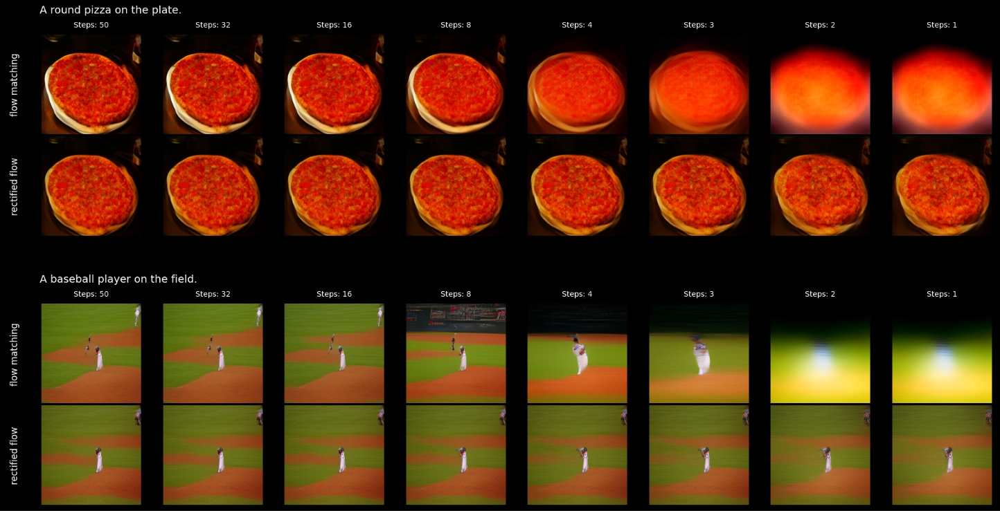
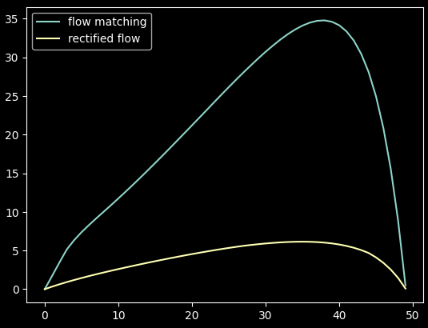
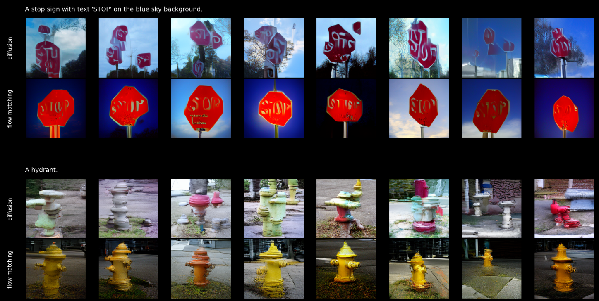
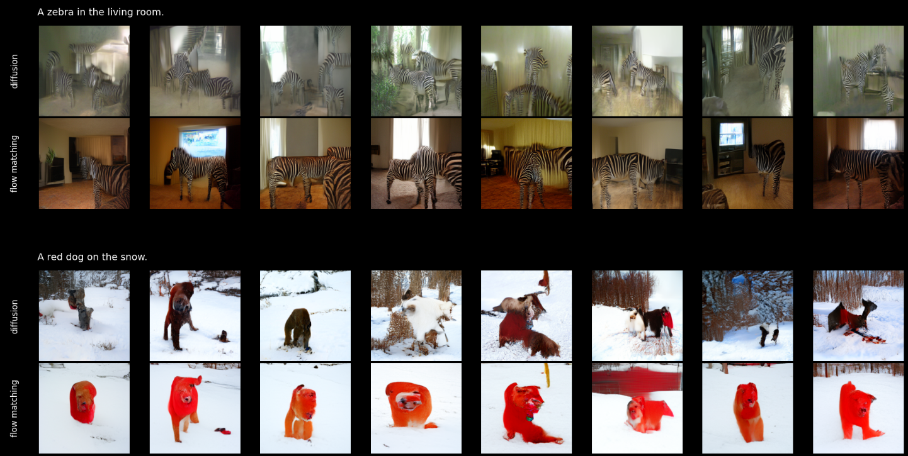
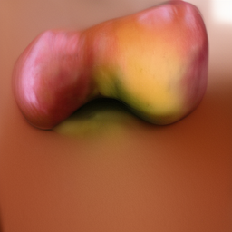
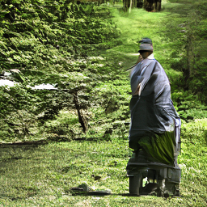
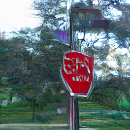
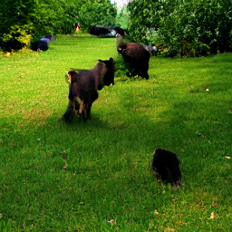

# Continuos-Time Generative Models Workshop (CTGMWorkshop)

This is repository of development and training code of various continuos-time generative models like diffusion and flow matching models.

Treat the collection of notebooks as *workshop*, not as production training code. There might be bugs.

## Latest experimets

*13.06.2026*: Trained FlowUpscaler - a fast Flux.2 latent upscaling model.


* Upscales latents 2 times
* Trains with flow distillation from **Flux.2-klien-4B** as a teacher
* **59M** parameter Unet
* Samples in one denoising step
* Compute scales linearly with resolution, ~**0.00045** ms per one latent pixel

[ComfyUI node for this model](https://github.com/tensorforger/comfyui-flow-upscaler)
[Download weights](https://huggingface.co/TensorForger/FlowUpscaler)

For training details and latency benchmark see `notebooks/flow_upscaler` in this repo.

*07.06.2026*: Performed one iteration of **Flow Rectification** of previously trained flow matching model.

This is done by generating ~ 100K of noise-generation pairs with random prompts from dataset, large number of steps and cfg, 
and then fine-tuning model on these pairs for ~10 epochs.

This turns a flow matching model into true **Rectified Flow** model that has much straighter trajectories and can sample in much fewer steps
without cfg. 




Also measured distance of the trajectory during sampling from the perfect line between initial and final state.


*05.06.2026*: Trained a **Flow Matching** model with same architecture and same dataset as the diffusion model from the previous experiment.

Found that it is:

1) Starts to generate more or less understandable images much earlier during training
2) Fully trained model creates more structurally correct images
3) The prompt coherence is more accurate
4) Much better in producing zero-shot images (combinations that were not presented in the dataset)

Here is the visual comparison on some prompts:



Examples of zero-shot generations:



*03.06.2026*: Trained a base **117M** parameter diffusion model on the whole **COCO-2017** dataset.

Here are some generated samples and there prompt:

|                                    |                                               |                                                     |
|------------------------------------|-----------------------------------------------|-----------------------------------------------------|
|       |                    |                    |
|An apple on the table.              |There is a man walking on the path in the park.|A red stop sign next to trees.                       |
|    |                  |                     |
|A clean bathroom.                   |A plate with pizza on the table.               |There are two black dogs on the field of green grass.|

For more training and architecture details see `notebooks/train_models/train_larger_unet.ipynb`


# Installation

## 1. Clone the Repository

```bash
git clone https://github.com/tensorforger/CTGMWorkshop
cd CTGMWorkshop
```

## 2. Install Dependencies

```bash
# Create environment
conda create -n ctgmworkshop python=3.12 pip -y
conda activate ctgmworkshop

# Install PyTorch with CUDA support (adjust if needed)
pip install torch torchvision --index-url https://download.pytorch.org/whl/cu128

# Install project dependencies
pip install -r requirements.txt
```

## 3. Download Models

While main generative models are trained from scratch here, some pre-trained parts like VAE and text encoders are still used in some experiments.

```bash
cd CTGMWorkshop
git clone https://huggingface.co/black-forest-labs/FLUX.2-klein-4B
git clone https://huggingface.co/stabilityai/stable-diffusion-xl-base-1.0
```

## 4. Download Dataset

The main training dataset of Text-Image pairs would be COCO2017 here with **591k** pairs.

Download from [http://images.cocodataset.org/zips/train2017.zip](http://images.cocodataset.org/zips/train2017.zip)

Or use `notebooks/1.download-coco-dataset.ipynb`


#  Contributing

This is a research-oriented project under active development.

You can report issues if you can't fix them by your own: [https://github.com/tensorforger/CTGMWorkshop/issues](https://github.com/tensorforger/CTGMWorkshop/issues).

